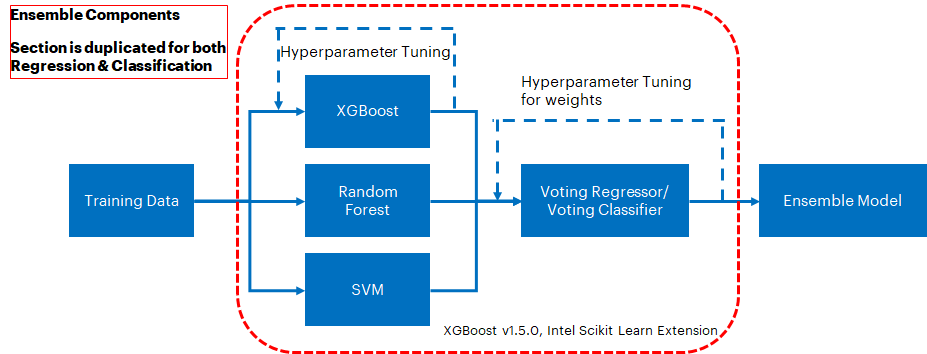
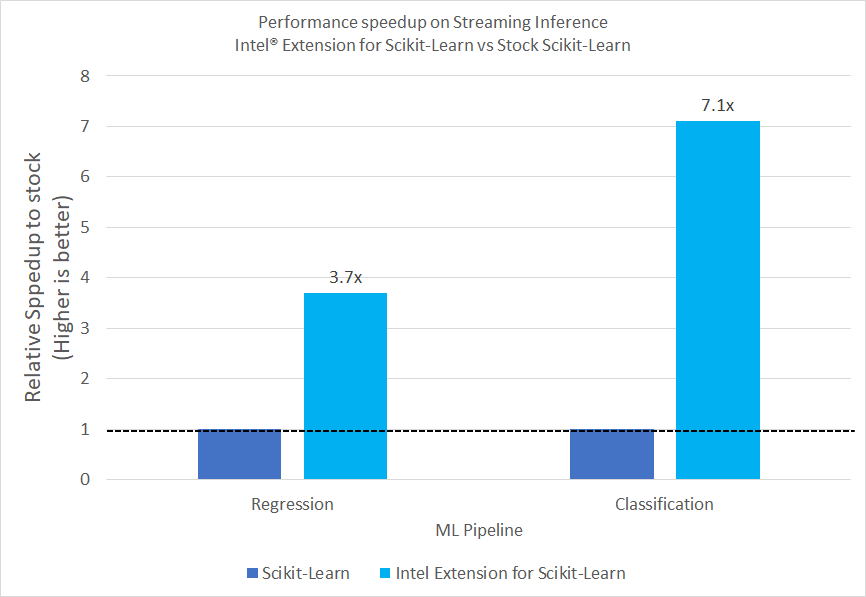
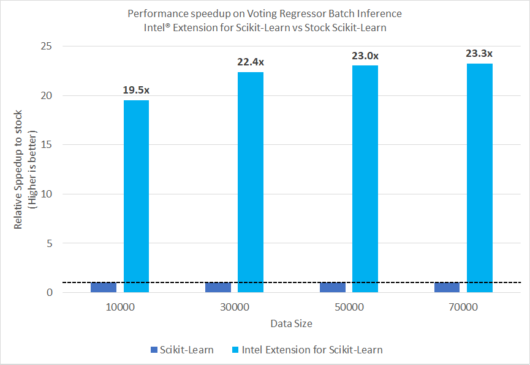
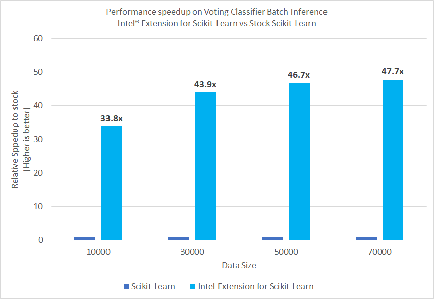

PROJECT NOT UNDER ACTIVE MANAGEMENT

This project will no longer be maintained by Intel.

Intel has ceased development and contributions including, but not limited to, maintenance, bug fixes, new releases, or updates, to this project.  

Intel no longer accepts patches to this project.

If you have an ongoing need to use this project, are interested in independently developing it, or would like to maintain patches for the open source software community, please create your own fork of this project.  

Contact: webadmin@linux.intel.com
# **Order to Delivery (OTD) Forecasting - Building an Ensemble Model using XGBoost, Random Forests and Support Vector Machines**

Delivery time forecasting models can be built with individual Machine Learning (ML) packages such as XGBoost (XGB), Random Forests (RF) and Support Vector Machines (SVM). These can be fed to an ensembling technique such as Voting Regressor/Classifier to improve the accuracy of the model. The Intel® AI Analytics Toolkit (AI Kit) gives data scientists, AI developers, and researchers familiar Python tools and frameworks to accelerate end-to-end data science and analytics pipelines on Intel architectures. The components are built using oneAPI libraries for low-level compute optimizations. We will use the the Intel® Extension for Scikit-learn*, powered by the Intel® oneAPI Data Analytics Library (oneDAL), to accelerate the individual build components as well as the ensemble model build.

# **Contents**
 - [Purpose](#purpose)
 - [Reference Solution](#reference-solution)
 - [Comparing Performance Benefits](#comparing-performance-benefits)
 - [Key Takeaways](#key-takeaways)
 - [Appendix](#appendix)

 ## **Purpose**

 Ease of e-commerce over the last decade, along with the recent COVID-19 pandemic, has seen a marked shift in consumer behavior and expectations when it comes to purchase - and more importantly, the delivery of goods. This has caused a paradigm shift in functioning of the supply chain. Along with delivery speed, consumers feel that the **transparency** around delivery time and shipment status are an equally important aspect of the fulfilment process. This has direct implications in customer churn/retention. More than half of consumers are less likely to shop with a retailer if the item is not delivered within 2 days of date promised. [(source)](https://www.hollingsworthllc.com/how-late-deliveries-impact-customer-retention/) 

  An ML based predictive solution for providing delivery time forecasting can provide great insights to e-commerce platforms. From a customer-facing point of view these insights would help e-commerce platforms to give more accurate delivery forecasts to customers and decrease customer churn. In addition, the ML based predictive solution will also allow e-commerce platforms to take pre-emptive actions to mitigate delays, costs, and loss of revenue. 

## **Reference solution**

For the individual components of the ensemble model, we will use XGB, RF and SVM. These components will then be fed to a Voting Model, which is an ensemble model that combines the individual predictions to provide a final, consensus prediction. The final consensus prediction can be (1) a prediction for a wait time for a package and (2) if a delay will occur.

This section provides key implementation details on the proposed reference solution for the target use case. It is organized as follows:

1. Dataset Details & Schema
2. Proposed reference end-to-end architecture
3. Setting up the stock environment
4. Executing the reference architecture pipeline components
5. Optimizing the reference solution pipeline using libraries from the Intel AI Analytics Toolkit.

### **Dataset Details and Schema**
Before we delve into the proposed architecture of the solution pipeline, it is critical to understand the dataset and its schema. The dataset consists of real-world delivery details sourced from a Brazilian E-commerce Company which was scrubbed and anonymized. It can be found [here](https://www.kaggle.com/datasets/olistbr/brazilian-ecommerce?select=olist_order_items_dataset.csv).

It consists of multiple tables which include relevant information about the customer, seller, order, location etc. The individual tables are interconnected as shown in the following schema. Relevant features will be extracted/designed from this data and then be used to train our supervised ML model.


### **Proposed Architecture**
From a business perspective, we need to tackle two main challenges to ensure transparency for the customer:
1. Extracting insights/estimates into forecasted delivery
2. Increasing the accuracy of those insights and estimates

We can achieve the first objective by implementing multiple pipelines with separate objectives and the second one by utilizing techniques such as ensemble modeling to increase the accuracy of stand-alone ML components.

A schematic of the proposed reference architecture is shown in the following figure. We start off with Data Ingestion from the multiple tables of the dataset, followed by merging and preprocessing for feature extraction. We can use the features to extract delivery insights in the form of **predicted wait time** as well as **likelihood of delivery delay**. The former is a regression problem and the latter is a classification problem. For this purpose we will execute two separate pipelines:

**Regression Pipeline:**
This consists of training individual regression models built & tuned using three separate ML components including XGB, RF and SVM to predict the **expected wait time** for a package. The trained models from these components will then be fed to an ensemble voting regressor model to increase the prediction accuracy (in this case, measured by Mean Squared Error or MSE).

**Classification Pipeline**
This consists of training individual classification models built & tuned using three separate ML components including XGB, RF and SVM to predict the **likelihood of delay occurrence** for a package. The trained models from these components will then be fed to an ensemble voting classifier model to increase the prediction accuracy.

Within **each** pipeline, the components are configured as shown in the figure that follows the overall schematic. The individual components will be regressors or classifiers depending the pipeline they are supporting.

The final solution will consist of 2 ensemble models for the respective (regression and classification) pipelines, which can then be deployed into production. Enterprises can use the deployed solution for running inference on fresh data gathered from their ecommerce platform. The responses from these two models i.e. expected wait time and the likelihood of delay will allow enterprises to take preemptive action such as course correction or to engage with the customer to maintain transparency.

For the purpose of the reference solution, in order to test for model accuracy and inference speed we ran inference using data that is kept aside purely for inference (highlighted in the section for Reference Pipeline Execution). 

<br>


**Note on choice of stand-alone components:** The choice of XGB, RF and SVM was made on the basis of what is commonly used in practice. Users are free to test other frameworks to tune the performance. Keep in mind, however, an ensemble model enhances performance of its stand-alone components only when the individual performance is comparable. For example, if there is an order of magnitude difference between the accuracy of model A and model B, it is unlikely that an ensemble model with model A and model B will perform better than both. We will see in the section for benchmarking results that RF, XGB and SVM performance is indeed comparable, and as a result, the voting ensemble model outperforms all three in both regression & classification pipelines.


### **Stock Packages Used**
- Python v3.9
- Pandas v1.5.1
- NumPy v1.23.4
- Scikit-Learn v1.1.2
- XGBoost v1.6.0

### **Setting up Stock Environment**

To execute the scripts provided in the reference kit, you will need to work on the Anaconda platform. Download and installation instructions for a Linux machine can be found [here](https://docs.anaconda.com/anaconda/install/linux/)

Once Anaconda is installed, clone the git repository using the following command:
```shell
git clone https://github.com/oneapi-src/order-to-delivery-time-forecasting
```

Move into the cloned folder to set the environment.
```shell
cd oneAPI-ForecastDelivery-SciKit
```

The script `setupenv.sh` is provided to automate the setup of the conda environments necessary for this reference kit. Once you clone the git repo on your workstation/virtual machine (VM), in the parent directory you just moved to, execute the following command

```shell
chmod +rwx setupenv.sh
./setupenv.sh
```
This will prompt for the selection of stock/intel packages. Select 1 for stock

Example option selection for creating stock/intel environment as given below
```shell
Select technology distribution:
    1. stock 
    2. intel
```
Once the environment is setup, activate the stock environment using the following command.

```shell
conda activate OTD_stock
```
You can then move ahead to data download and executing the classification and regression pipelines.
### **Data Ingestion**

Please download the data using the instructions provided in the `/data` folder and extract the individual CSV files. Afterward, you should have a total of 9 CSV files. Once the data is read(as a Pandas dataframe) and features are extracted from the data, you will end up with close to 100K delivery records. For the regression pipeline, we will use 8 features and the response target will be a FP32 value for an expected wait time. For the classification pipeline, we will use a total of 9 features and the response target  will be a class of 0 or 1, where 1 means a delay is expected. Using standard machine learning practices, the data will be split into train and test sections using a standard 70:30 split. The former is used to train our ML models which are then tested for accuracy using the latter. 

We noticed that the pipeline execution is highly time & memory intensive while using stock packages. Hence the data size for hyperparameter tuning is kept to ~8K. The final model, which is used to run inference, is trained using a data-size of ~32K and the best parameters from the hypertuning exercise. Multiple data sizes from 1 to 70K were tested for running inference workloads. A batch size of 1 corresponds to streaming data, whereas the rest of the sizes correspond to batch workloads.

### **Regression Pipeline Execution**

As this is an ensembling exercise, the hyperparameter tuning, training and inference portions are all bundled in one script. Individual workloads are executed sequentially as follows:

1. Data Ingestion, preprocessing and feature extraction
2. Train/test split
3. Hyperparameter tuning for XGB
4. Hyperparameter tuning for RF
5. Hyperparameter tuning for SVM
6. Hyperparameter for Voting Regressor using **best estimators** from steps 3,4,5
7. Training a Voting Regressor using **best weights** from step 6
8. Running Inference on XGB, RF, SVM and Voting Regressor to quantify accuracy gain from Voting Regressor, if any using test data from step 2
9. Saving final Voting Regressor model which can be used in deployment

The run benchmark script takes the following arguments:

```shell
usage: run_benchmarks_regression.py [-l LOGFILE] [-i] [-m MODELFILE]

optional arguments:
  -l    LOGFILE,  --logfile     log file to output benchmarking results to
  -i              --intel       use intel accelerated technologies where available
  -m  MODELFILE   --modelfile   model file name to which final model will be saved
```
To run with stock technologies logging the performance to `logs`, we would run this command from the parent directory (after creating the appropriate environment as above):
```shell
python ./src/run_benchmarks_regression.py -l ./logs/stock_reg.log -m stock_regression.pkl
```

#### **Expected Input/Output for Regression**

| **Input**                   | **Output**                   
| :---                          | :---                                  
| CSV files read as Pandas dataframes<br> Pandas dataframes are then translated into 8 numeric features such as package size, weight, transit distance, time of purchase, etc.                    | FP32 value prediction for an expected wait time <br> <br> Final Voting Ensemble Regression model pkl file


### **Classification Pipeline Execution**

The Classification pipeline execution is largely similar to the one for Regression. Once again, as this is an ensembling exercise, the hyperparameter tuning, training and inference portions are all bundled in one script. Individual workloads are executed sequentially as follows:

1. Data Ingestion, preprocessing and feature extraction
2. Train/test split
3. Hyperparameter tuning for XGB
4. Hyperparameter tuning for RF
5. Hyperparameter tuning for SVM
6. Hyperparameter for Voting Classifier using **best estimators** from steps 3,4,5
7. Training a Voting Classifier using **best weights** from step 6.
8. Running Inference on XGB, RF, SVM and Voting Classifier to quantify accuracy gain from Voting Classifier, if any using test data from step 2
9. Saving final Voting Classifier model which can be used in deployment

The run benchmark script takes the following arguments:

```shell
usage: run_benchmarks_classification.py [-l LOGFILE] [-i] [-m MODELFILE]

optional arguments:
  -l    LOGFILE,  --logfile     log file to output benchmarking results to
  -i              --intel       use intel accelerated technologies where available
  -m  MODELFILE   --modelfile   model file name to which final model will be saved
```
To run with stock technologies, logging the performance to `logs`, we would run this command from the parent directory  (after creating the appropriate environment as above):
```shell
python ./src/run_benchmarks_classification.py -l ./logs/stock_class.log -m stock_classification.pkl
```

#### **Expected Input/Output for Regression**

| **Input**                   | **Output**                   
| :---                          | :---                                  
| CSV files read as Pandas dataframes<br> Pandas dataframes are then translated into 9 numeric features such as package size, weight, transit distance, time of purchase, initial wait time estimate from the platform (not from the Regression pipeline), etc.                    | Binary class predicting whether the shipment will be on time [0] or delayed [1] <br> <br> Final Voting Ensemble Regression model pkl file

## **Optimizing the Reference solution using libraries from the Intel AI Analytics Toolkit**

The reference solution architecture for an Intel-optimized pipeline is largely unchanged except the execution using Intel® Extension for Scikit Learn for RF, SVM and Voting Regressor/Classifier. XGBoost version will stay the same (v1.6.0) <br>




The **expected output** for the optimized is also similar to what we observed for the stock pipeline except for the accelerated times. This will be discussed more in the section for [Comparing Performance Benefits](#comparing-performance-benefits)

### **Intel Packages Used**

- Python v3.9
- Pandas v1.5.0
- numpy v1.21.4
- scikit-learn v1.0.1
- Intel scikit-learn extension v2021.6.0
- XGBoost v1.6.0

#### **Intel® Extension for Scikit-learn**

Intel® Extension for Scikit-Learn* provides a seamless way to accelerate the stock scikit-learn packages for machine learning. This extension package dynamically patches scikit-learn estimators to use Intel® oneAPI Data Analytics Library (oneDAL) as the underlying solver, which helps accelerate training and inference performance.

### **Setting up Intel Environment**

Follow the same instructions as the ones for setting up a stock environment. 

Move into the cloned folder to set the environment.
```shell
cd oneAPI-ForecastDelivery-SciKit
```

Execute the following commands (the execute permissions will already be assigned duruing stock env creation, but is listed here in case intel env is created first)

```shell
chmod +rwx setupenv.sh
./setupenv.sh
```
This will prompt for the selection of stock/intel packages. Select 2 for intel.

```shell
Select technology distribution:
    1. stock
    2. intel
```
Once the environment is setup, activate the intel environment using the following command.

```shell
conda activate OTD_intel
```
You can then move ahead to executing the classification and regression pipelines using the Intel-optimized packages.

The data ingestion, expected input/output as well as the methodology followed in the classification and regression pipeline execution is identical to how it was setup for the stock version with the only exception that Intel optimizations are enabled here.

To run the **regression** pipeline with Intel technologies, logging the performance to `logs`, we would run this command from the parent directory (after creating the appropriate environment as above):
```shell
python ./src/run_benchmarks_regression.py -i -l ./logs/intel_reg.log -m intel_regression.pkl
```

To run the **classification** pipeline with Intel technologies, logging the performance to `logs`, we would run this command from the parent directory (after creating the appropriate environment as above):
```shell
python ./src/run_benchmarks_classification.py -i -l ./logs/intel_class.log -m intel_classification.pkl
```

## **Comparing Performance Benefits**

In this section, we illustrate the benchmarking results comparing the Intel-optimized libraries vs the stock alternative(s). The relevant ML operations that happen during execution of the Regression/Classification pipeline have been listed previously, but again included below for ease of reading:

1. Data Ingestion, preprocessing and feature extraction
2. Train/test split
3. Hyperparameter tuning for XGB
4. Hyperparameter tuning for RF
5. Hyperparameter tuning for SVM
6. Hyperparameter for Voting Model using **best estimators** from steps 3,4,5
7. Training a Voting Model using **best weights** from step 6.
8. Running Inference on XGB, RF, SVM and Voting Model to quantify gain from Voting Model, if any
9. Saving final Voting Model which can be used in deployment

From a business perspective, inference workloads are the most relevant to customers. Results from inference on both the regression and classification pipelines are shared in the charts below. 

<br>

1. Streaming Inference on a Voting Regressor and Classifier using Intel® Extension for Scikit-Learn compared to using Stock Scikit-Learn



2. Batch Inference on a Voting Regressor using Intel® Extension for Scikit-Learn compared to using Stock Scikit-Learn



3. Batch Inference on a Voting Classifier using Intel® Extension for Scikit-Learn compared to using Stock Scikit-Learn



## **Key Takeaways**

From the reference solution we can observe that a Voting Model built using Intel® Extension for Scikit-Learn offers performance speedup in streaming inference as well as batch inference. The performance gain started to plateau as data size increased.

**Streaming Inference:** For Regression, we noticed performance speedup of 3.7x whereas for classification, the speedup was 7.1x

**Batch Inference:** We tested inference workloads on multiple batch sizes from 10000 to 70000. For Regression, we observed performance speedups between 19.5 - 23.3x whereas for Classification we observed performance speedups between 33.8 - 47.7x.

**Accuracy:** Following are the accuracy numbers on inferencing in the stock environment. We did not notice any significant change in the numbers when the pipeline was run using Intel optimizations.

| **Data Size** | **XGB MSE** | **RF MSE** | **SVM MSE** | **Voting Regressor MSE**
| :---          | :---        | :---       | :---        | :---                   
| 70000         | 72.34       | 62.14      | 86.34       | 57.77

| **Data Size** | **XGB Accuracy**  | **RF Accuracy**  | **SVM Accuracy**   | **Voting Regressor Accuracy**
| :---          | :---              | :---             | :---               | :---                   
| 70000         | 0.917             | 0.924            | 0.926              | 0.931

**Business Perspective:** Improvements in both accuracy and speed add value to business operations. The improved accuracy will help make enterprises better decisions and ensure transparency with their customers. Whereas the large accelerations in the workloads will enable enterprises to choose cheaper resources. This is especially important for small scale edge devices where a lot of the inference workloads are handled. Business will be able to realize this lower Total Cost of Ownership, almost immediately.

**Note on Performance Gain:**

 The performance gain is dependent on multiple factors such as hardware infrastructure, hyperparameters, trained model, data size and structure etc. The hardware chosen here is a typical VM configuration that customers use and the rest of the parameters are choices governed by the dataset as well as the computational capability. Changing any of these, which users are free to do, will change the performance numbers. The main objective of this reference kit is to demonstrate that a Voting Ensemble Model will result in an improve accuracy over using stand-alone models and using Intel optimized packages will speedup that process. The presented results confirm that.

## **Appendix**

### **Experiment Setup**
- **Date Testing Performed:** October 2022
- **Configuration Details and Workload Setup:** Azure D8v5 (Intel® Xeon® Platinum 8370C CPU @ 2.80GHz), 1 Socket, 4 Cores per Socket, 2 Threads per Core, Turbo:On, Total Memory: 32 GB, OS: Ubuntu 20.04, Kernel: Linux 5.15.0-1019-azure, Software: Scikit-Learn* v1.1.2, XGBoost* v1.6.0, Scikit-Learn* v1.0.1, Intel® Extension for Scikit-Learn* v2021.6.0
- **Testing performed by** Intel Corporation
  
| **Configuration**:                | **Description**
| :---                              | :---
| Platform                          | Microsoft Azure: Standard_D8s_v5 (IceLake) <br> Ubuntu 20.04
| Processing Hardware               | Intel IceLake Xeon Platinum 8370C CPU @ 2.8GHz <br> 32GB
|  Software                          | XGBoost (v1.6.0 for both envs) <br> Pandas (stock_version: 1.5.1, intel_version:1.5.0) <br> Scikit-learn (stock_version: 1.1.2) <br> Scikit-learn (intel_version: 1.0.1)  <br> Intel® Extension for Scikit-Learn (2021.6.0) <br> The stock/intel Scikit-learn versions because the Scikit_Learn is installed as part of the Extension and will default to v
| What you will learn               | Intel® oneAPI performance advantage over the stock packages for building a Voting Ensemble model

**Note on XGBoost version:**

Intel has released XGBoost optimizations for training and inference as part of the general XGBoost release. However, in the case of the ensemble model built in this reference solution, the benefit of Intel Optimizations is largely driven by using the Intel® Extension for Scikit-Learn. For this purpose, we decided to keep the versions of XGBoost in both stock and intel environments the same (1.6.0), even though it means the solution built in the stock environment will have some Intel optimizations.

Also, in all cases, XGBoost hyperparameter tuning and training was done using the `hist` tree method as Intel optimizations for training are limited to `hist` tree method

**Operating System:**
We recommend using an Linux OS for executing the reference solution presented here, e.g. RHEL or Ubuntu.

## **Notes**

**Intel Corporation does not own the rights to this data set and does not confer any rights to it.**

### **Notices and Disclaimers**
Please see this data set's applicable license for terms and conditions. Intel Corporation does not own the rights to this data set and does not confer any rights to it.
Performance varies by use, configuration and other factors. Learn more on the Performance Index site. 
Performance results are based on testing as of dates shown in configurations and may not reflect all publicly available updates.  See backup for configuration details.  No product or component can be absolutely secure. 
Your costs and results may vary. 
Intel technologies may require enabled hardware, software or service activation.
© Intel Corporation.  Intel, the Intel logo, and other Intel marks are trademarks of Intel Corporation or its subsidiaries.  Other names and brands may be claimed as the property of others.  

To the extent that any public or non-Intel datasets or models are referenced by or accessed using tools or code on this site those datasets or models are provided by the third party indicated as the content source. Intel does not create the content and does not warrant its accuracy or quality. By accessing the public content, or using materials trained on or with such content, you agree to the terms associated with that content and that your use complies with the applicable license.
 
Intel expressly disclaims the accuracy, adequacy, or completeness of any such public content, and is not liable for any errors, omissions, or defects in the content, or for any reliance on the content. Intel is not liable for any liability or damages relating to your use of public content.
